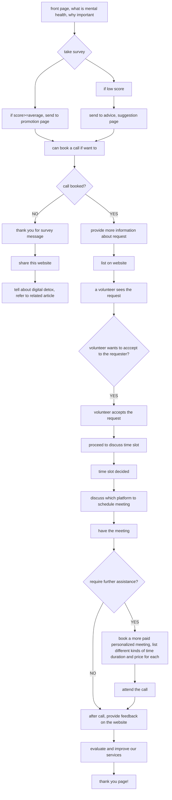

## Mermaid diagram for project titled "Anonymous mental health consulting website"

```mermaid
flowchart
front[front page, what is mental health, why important]
front-->s{take survey}
s-->p[if low score]
p-->adv[send to advice, suggestion page]
s-->promo[if score>=average, send to promotion page]
promo-->call[can book a call if want to]
adv-->call;
call-->d{call booked?}
d-->|YES|info[provide more information about request]
-->li[list on website]
d-->|NO|thank[thank you for survey message]-->promote[share this website]
-->detox[tell about digital detox, refer to related article]
li-->see[a volunteer sees the request]
see-->vd{volunteer wants to acccept to the requester?}
vd-->|YES|a[volunteer accepts the request]
-->time[proceed to discuss time slot]
-->decide[time slot decided]
-->platform[discuss which platform to schedule meeting]
-->meet[have the meeting]
-->more{require further assistance?}
more-->|YES|pay
more-->|NO|feed
pay[book a more paid personalized meeting, list different kinds of time duration and price for each]
-->pcall[attend the call]-->feed[after call, provide feedback on the website]
feed-->imp[evaluate and improve our services]-->t[thank you page!]
```
