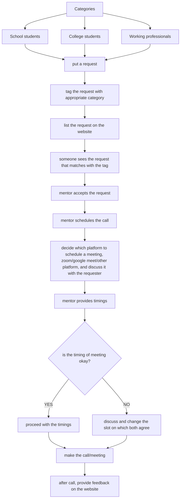

## Mermaid diagram for the mini titled "Website for seeking mentorship"

```mermaid
flowchart 
  Categories --> ss[School students]
	Categories --> cs[College students]
	Categories --> wp[Working professionals]
ss --> req[put a request]
cs --> req
wp --> req
req-->tag[tag the request with appropriate category]
tag --> li[list the request on the website] 
--> see[someone sees the request that matches with the tag] 
--> accept[mentor accepts the request]

accept-->call[mentor schedules the call]
-->platform[decide which platform to schedule a meeting, zoom/google meet/other platform, and discuss it with the requester]
-->time[mentor provides timings]

time-->decision{is the timing of meeting okay?}
decision-->|YES|yes[proceed with the timings]
decision-->|NO|no[discuss and change the slot on which both agree]
yes-->proceed[make the call/meeting]
no-->proceed
proceed-->feed[after call, provide feedback on the website]
```
